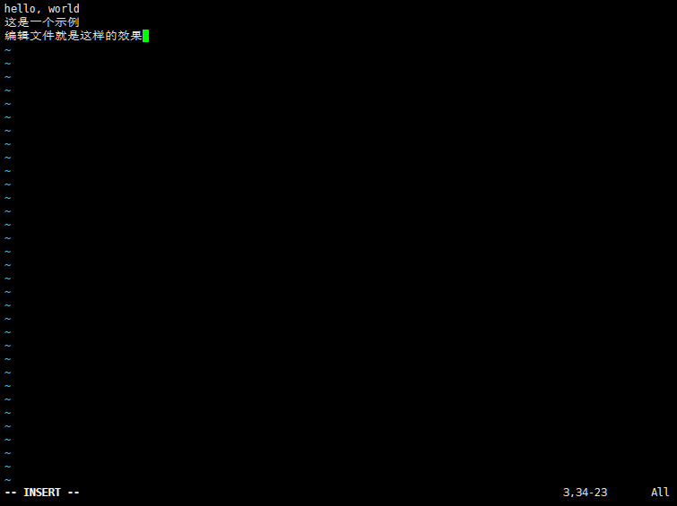
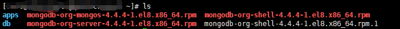

SkyTown Shell 命令语法稿（示例） v1.0.0.0

1. * `echo "hello, world!"`：显示`hello, world!`
   * `echo "hello" > example.skt`：在目录下的skt文件夹下的example.skt文件（如果没有则创建）写入`hello`字样
2. `vim "example.skt"`：打开vim并可以编辑example.skt文件：
3. `view "example.skt"`：显示example.skt的内容
4. `mkdir "hm"`：在目录下创建hm目录
5. `cd "/hm"`：打开/hm目录（如果是变量则将目录存于变量中，不打开）
6. `ls`：列出现目录下的所有目录
7. `exit`：直接退出终端
8. `fp = cd "hm"`+`cp "example.skt" fp`：将现目录下的example.skt文件拷贝到hm目录下
9. `tcr "abc"`：创建abc.skt文件
10. `tree`：现阶段等同于ls命令
11. `w`：显示用户在平台上的用户名
12. `ABOUT`：显示`SkyTownShell version: 版本号`
13. `"sky" = "town"`（带引号）：以后凡使用`sky`（不带引号），都会自动替换为`"town"`
14. `remove "example.skt"`：删除example.skt文件
15. `redir "example"`：删除example文件夹